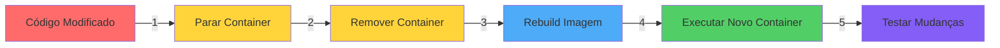
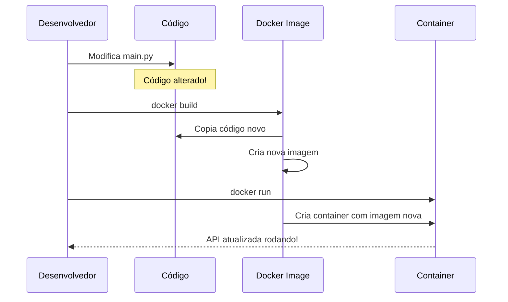
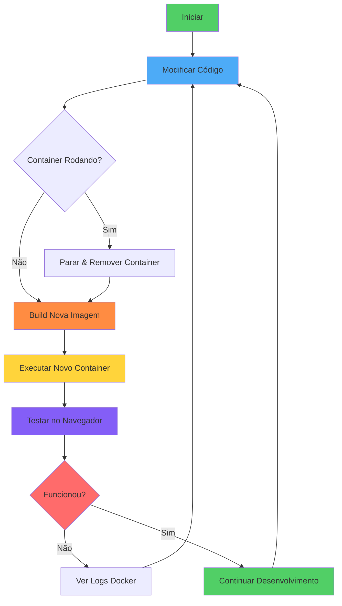

# Guia Rápido: Atualizar Imagem Docker

## 🎯 Resumo Executivo

Quando você modifica o código da API, precisa **reconstruir** a imagem Docker para que as mudanças sejam aplicadas no container.

## 📊 Fluxo de Atualização



## 🚀 Comandos Passo a Passo

### Método 1: Passo a Passo (Didático)

```bash
# 1️⃣ Parar o container em execução
docker stop hello-api-container

# 2️⃣ Remover o container antigo
docker rm hello-api-container

# 3️⃣ Remover a imagem antiga (opcional)
docker rmi hello-api

# 4️⃣ Construir nova imagem com o código atualizado
docker build -t hello-api .

# 5️⃣ Executar o novo container
docker run -d -p 8000:8000 --name hello-api-container hello-api

# 6️⃣ Verificar se está funcionando
docker logs -f hello-api-container
```

### Método 2: Comando Único (Rápido)

```bash
docker stop hello-api-container && \
docker rm hello-api-container && \
docker build -t hello-api . && \
docker run -d -p 8000:8000 --name hello-api-container hello-api && \
docker logs -f hello-api-container
```

## 🔍 Entendendo o Processo

### Por que preciso reconstruir?



### O que cada comando faz?

| Comando | O que faz | Por que é necessário |
|---------|-----------|---------------------|
| `docker stop` | Para o container | Não pode remover container em execução |
| `docker rm` | Remove o container | Libera o nome `hello-api-container` |
| `docker rmi` | Remove a imagem | Libera espaço (opcional) |
| `docker build` | Cria nova imagem | Incorpora as mudanças do código |
| `docker run` | Cria e executa container | Inicia a API com código atualizado |

## ⚡ Atalhos Úteis

### Ver o que está rodando
```bash
# Listar containers em execução
docker ps

# Listar todos os containers (inclusive parados)
docker ps -a

# Listar todas as imagens
docker images
```

### Limpeza rápida
```bash
# Remover todos os containers parados
docker container prune

# Remover imagens não utilizadas
docker image prune

# Limpeza completa (CUIDADO!)
docker system prune -a
```

## 🎓 Exemplo Prático

### Cenário: Você alterou a rota `/` para redirecionar para `/docs`

**1. Código modificado:**
```python
# app/main.py
from fastapi.responses import RedirectResponse

@app.get("/", include_in_schema=False)
def read_root():
    return RedirectResponse(url="/docs")
```

**2. Atualizar container:**
```bash
# Comando único
docker stop hello-api-container && \
docker rm hello-api-container && \
docker build -t hello-api . && \
docker run -d -p 8000:8000 --name hello-api-container hello-api
```

**3. Testar:**
- Acesse: http://localhost:8000
- Deve redirecionar automaticamente para `/docs`

**4. Ver logs (debug):**
```bash
docker logs -f hello-api-container
```

## 🎯 Ciclo de Desenvolvimento



## 💡 Dicas Pro

### 1. Cache do Docker
- Se você só alterou o código Python (não as dependências), o build será rápido
- O Docker usa cache das camadas anteriores

### 2. Debug em tempo real
```bash
# Sempre mantenha os logs abertos durante testes
docker logs -f hello-api-container
```

### 3. Verificar se está mesmo atualizado
```bash
# Ver quando a imagem foi criada
docker images hello-api

# Ver detalhes do container
docker inspect hello-api-container
```

### 4. Criar alias para agilizar (opcional)
```bash
# No seu .bashrc ou .zshrc
alias drebuild='docker stop hello-api-container && docker rm hello-api-container && docker build -t hello-api . && docker run -d -p 8000:8000 --name hello-api-container hello-api && docker logs -f hello-api-container'

# Uso:
drebuild
```

## ❓ Problemas Comuns

### Erro: "Container já existe"
```bash
# Solução: Remova o container antigo
docker rm -f hello-api-container
```

### Erro: "Porta 8000 já em uso"
```bash
# Solução: Pare o que está usando a porta 8000
docker stop hello-api-container

# Ou use outra porta
docker run -d -p 8080:8000 --name hello-api-container hello-api
```

### Build muito lento
```bash
# Verifique o .dockerignore
cat .dockerignore

# Limpe imagens antigas
docker image prune
```

## 📚 Referências

- [Docker Build Documentation](https://docs.docker.com/engine/reference/commandline/build/)
- [Docker Run Documentation](https://docs.docker.com/engine/reference/commandline/run/)
- [Best Practices for Writing Dockerfiles](https://docs.docker.com/develop/develop-images/dockerfile_best-practices/)

---

**TL;DR (Muito Longo; Não Li):**

Modificou o código? Execute:
```bash
docker stop hello-api-container && docker rm hello-api-container && docker build -t hello-api . && docker run -d -p 8000:8000 --name hello-api-container hello-api
```

Acesse http://localhost:8000 e seja feliz! 🚀
