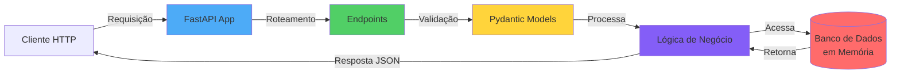
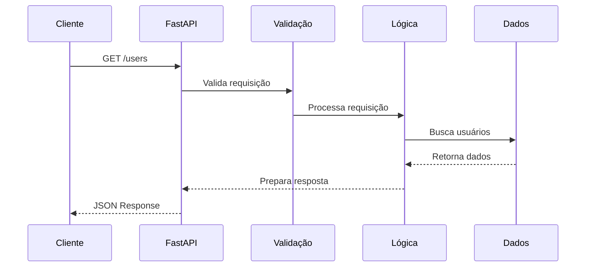

# Hello API - Tutorial Avançado

API RESTful desenvolvida com FastAPI, Docker e UV para estudantes avançados do LAB365.

## Tecnologias Utilizadas

- **FastAPI**: Framework moderno para construção de APIs
- **Docker**: Containerização da aplicação
- **UV**: Gerenciador de pacotes Python rápido
- **Uvicorn**: Servidor ASGI de alta performance
- **Swagger/OpenAPI**: Documentação automática da API

## Arquitetura da API



## Fluxo de Requisição



## Estrutura do Projeto

```
hello-api/
├── app/
│   └── main.py          # Código principal da API
├── Dockerfile            # Configuração do container
├── pyproject.toml        # Dependências do projeto (UV)
├── .dockerignore         # Arquivos ignorados pelo Docker
└── README.md            # Este arquivo
```

## Endpoints da API

A API possui 5 endpoints principais:

### 1. GET `/` - Root
Redireciona automaticamente para a documentação em `/docs`

### 2. GET `/users` - Listar Usuários
Retorna todos os usuários cadastrados

### 3. GET `/users/{user_id}` - Buscar Usuário
Retorna um usuário específico pelo ID

### 4. POST `/users` - Criar Usuário
Cria um novo usuário no sistema

### 5. GET `/health` - Health Check
Verifica o status da API

## Pré-requisitos

### Opção 1: Executar com Docker
- [Docker](https://www.docker.com/get-started) instalado

### Opção 2: Executar Localmente
- Python 3.11 ou superior
- UV (gerenciador de pacotes)

## Como Executar o Projeto

### Passo 1: Clone o Repositório

```bash
git clone https://github.com/IA-para-DEVs-SD/hello-api.git
cd hello-api
```

### Opção A: Executar com Docker

#### 1. Build da imagem Docker

```bash
docker build -t hello-api .
```

Este comando irá:
- Construir a imagem Docker
- Instalar as dependências usando UV
- Preparar o container

#### 2. Execute o container

```bash
docker run -d -p 8000:8000 --name hello-api-container hello-api
```

Parâmetros:
- `-d`: Executa em background (detached)
- `-p 8000:8000`: Mapeia a porta 8000 do container para a porta 8000 do host
- `--name hello-api-container`: Define o nome do container

#### 3. Acesse a API

A API estará disponível em:

- **API**: http://localhost:8000 (redireciona automaticamente para `/docs`)
- **Documentação Swagger**: http://localhost:8000/docs
- **Documentação ReDoc**: http://localhost:8000/redoc

#### 4. Como Atualizar a Imagem Após Mudanças no Código

> 📖 **Guia completo disponível:** [DOCKER-WORKFLOW.md](DOCKER-WORKFLOW.md) com diagramas e exemplos detalhados

Quando você modificar o código da API, siga estes passos para atualizar o container Docker:

```bash
# Passo 1: Parar e remover o container existente
docker stop hello-api-container
docker rm hello-api-container

# Passo 2: Remover a imagem antiga (opcional, mas recomendado)
docker rmi hello-api

# Passo 3: Criar nova imagem com as mudanças
docker build -t hello-api .

# Passo 4: Executar o novo container
docker run -d -p 8000:8000 --name hello-api-container hello-api
```

**Atalho (tudo em um comando):**
```bash
docker stop hello-api-container && docker rm hello-api-container && docker build -t hello-api . && docker run -d -p 8000:8000 --name hello-api-container hello-api
```

**Verificar se está funcionando:**
```bash
# Ver logs do container
docker logs hello-api-container

# Ou ver logs em tempo real
docker logs -f hello-api-container
```

#### Comandos Úteis do Docker

```bash
# Ver logs do container
docker logs hello-api-container

# Ver logs em tempo real
docker logs -f hello-api-container

# Parar o container
docker stop hello-api-container

# Iniciar o container novamente
docker start hello-api-container

# Remover o container
docker rm hello-api-container

# Remover a imagem
docker rmi hello-api
```

### Opção B: Executar Localmente (Sem Docker)

#### 1. Instale o UV

```bash
# Windows (PowerShell)
powershell -c "irm https://astral.sh/uv/install.ps1 | iex"

# Linux/macOS
curl -LsSf https://astral.sh/uv/install.sh | sh
```

#### 2. Crie um ambiente virtual e instale as dependências

```bash
# Criar ambiente virtual
uv venv

# Ativar ambiente virtual
# Windows
.venv\Scripts\activate

# Linux/macOS
source .venv/bin/activate

# Instalar dependências
uv pip install fastapi uvicorn[standard]
```

#### 3. Execute a API

```bash
uvicorn app.main:app --reload --host 0.0.0.0 --port 8000
```

Parâmetros:
- `--reload`: Recarrega automaticamente quando o código é modificado
- `--host 0.0.0.0`: Permite acesso externo
- `--port 8000`: Define a porta (padrão: 8000)

#### 4. Acesse a API

A API estará disponível em:

- **API**: http://localhost:8000
- **Documentação Swagger**: http://localhost:8000/docs
- **Documentação ReDoc**: http://localhost:8000/redoc

## Testando os Endpoints

### Via Swagger UI (Recomendado)

1. Acesse http://localhost:8000/docs
2. Experimente os endpoints diretamente pela interface

### Via cURL

#### Listar todos os usuários
```bash
curl http://localhost:8000/users
```

#### Buscar usuário específico
```bash
curl http://localhost:8000/users/1
```

#### Criar novo usuário
```bash
curl -X POST http://localhost:8000/users \
  -H "Content-Type: application/json" \
  -d '{"id": 3, "name": "Pedro Costa", "email": "pedro@example.com"}'
```

#### Health check
```bash
curl http://localhost:8000/health
```


## Próximos Passos

Experimente modificar a API:

1. Adicione novos endpoints
2. Implemente validações mais complexas
3. Adicione um banco de dados (PostgreSQL, MongoDB)
4. Implemente autenticação JWT
5. Adicione testes automatizados

## Exercício Prático

### Nível 1 - Básico
1. Clone este repositório
2. Execute a aplicação (escolha Docker ou local)
3. Acesse a documentação Swagger em `/docs`
4. Teste todos os 5 endpoints via Swagger
5. Teste os endpoints via cURL no terminal

### Nível 2 - Intermediário
1. Adicione um novo endpoint `DELETE /users/{user_id}`
2. Adicione validação de e-mail no modelo User usando Pydantic
3. Crie um endpoint `PUT /users/{user_id}` para atualizar usuários
4. Adicione tratamento de erros personalizado

### Nível 3 - Avançado
1. Integre um banco de dados real (SQLite, PostgreSQL)
2. Implemente autenticação JWT
3. Adicione testes automatizados com pytest
4. Configure CORS para permitir requisições de frontend
5. Adicione logging estruturado

## Dicas e Boas Práticas

### Desenvolvimento com Docker

**Durante o desenvolvimento:**
- Use o atalho para atualizar rapidamente após mudanças no código
- Mantenha os logs abertos com `docker logs -f` para debug em tempo real
- Se não houver mudanças nas dependências, o build será mais rápido (cache)

**Limpeza periódica:**
```bash
# Listar todas as imagens
docker images

# Listar todos os containers (incluindo parados)
docker ps -a

# Remover containers parados
docker container prune

# Remover imagens não utilizadas
docker image prune
```

### Fluxo de Trabalho Recomendado

1. **Primeira vez:**
   - Clone o repositório
   - Execute `docker build -t hello-api .`
   - Execute `docker run -d -p 8000:8000 --name hello-api-container hello-api`

2. **Durante o desenvolvimento (quando alterar código):**
   ```bash
   docker stop hello-api-container && docker rm hello-api-container && docker build -t hello-api . && docker run -d -p 8000:8000 --name hello-api-container hello-api && docker logs -f hello-api-container
   ```

3. **Para debug:**
   - Use `docker logs -f hello-api-container` para ver logs em tempo real
   - Acesse http://localhost:8000 para testar automaticamente (redireciona para /docs)

## Recursos Adicionais

- [Documentação FastAPI](https://fastapi.tiangolo.com/)
- [Documentação Docker](https://docs.docker.com/)
- [Documentação UV](https://docs.astral.sh/uv/)
- [Tutorial Docker para Python](https://docs.docker.com/language/python/)

## Suporte

Para dúvidas e problemas, abra uma issue no repositório.

---

Desenvolvido para o curso **IA para DEVs [SD]** - LAB365 / SENAI
